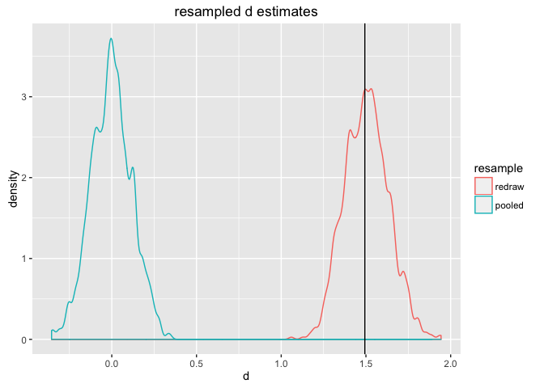

Data from [Table 7. Height in centimeters for children and adolescents aged 2–19 years and number of examined persons, mean, standard error of the mean, and selected percentiles, by sex and age: United States, 2007–2010](http://www.cdc.gov/nchs/data/series/sr_11/sr11_252.pdf).

``` r
library("ggplot2")
h <- data.frame(sex=c('Male','Female'),
                n=c(179,118),
                mean=c(177.8,163.4),
                seOfMean=c(0.81,0.72),
                stringsAsFactors = FALSE)
h$sdOfIndividuals <- sqrt(h$n)*h$seOfMean
print(h)
```

    ##      sex   n  mean seOfMean sdOfIndividuals
    ## 1   Male 179 177.8     0.81       10.837061
    ## 2 Female 118 163.4     0.72        7.821202

``` r
pooledSD <- ((h[1,'n']-1)*h[1,'sdOfIndividuals']+(h[2,'n']-1)*h[2,'sdOfIndividuals'])/
  (h[1,'n']+h[2,'n']-2)
z <- (h[1,'mean']-h[2,'mean'])/(pooledSD/sqrt(h[1,'n']+h[2,'n']))
print(z)
```

    ## [1] 25.74076

``` r
d <- (h[1,'mean']-h[2,'mean'])/pooledSD
print(d)
```

    ## [1] 1.49363

``` r
# simulate 
set.seed(23525)
popMale <- rnorm(n=h[1,'n'],mean = h[1,'mean'], sd = sqrt(h[1,'n'])*h[1,'seOfMean'])
popFemale <- rnorm(n=h[2,'n'],mean = h[2,'mean'], sd = sqrt(h[2,'n'])*h[2,'seOfMean'])

sumCross <- 0
nCross <- 0
for(a in popMale) {
  for(b in popFemale) {
    sumCross <- sumCross + (a-b)^2
    nCross <- nCross + 1
  }
}
print(sqrt(sumCross/nCross))
```

    ## [1] 21.65585

``` r
sumMale <- 0
nMale <- 0
for(a in popMale) {
  for(b in popMale) {
    sumMale <- sumMale + (a-b)^2
    nMale <- nMale + 1
  }
}
print(sqrt(sumMale/nMale))
```

    ## [1] 16.24591

``` r
print(sd(popMale)*sqrt(2))
```

    ## [1] 16.29148

``` r
print(sqrt(sumCross/nCross)/sqrt(sumMale/nMale))
```

    ## [1] 1.333003

``` r
sumFemale <- 0
nFemale <- 0
for(a in popFemale) {
  for(b in popFemale) {
    sumFemale <- sumFemale + (a-b)^2
    nFemale <- nFemale + 1
  }
}
print(sqrt(sumFemale/nFemale))
```

    ## [1] 11.5592

``` r
print(sd(popFemale)*sqrt(2))
```

    ## [1] 11.60849

``` r
print(sqrt(sumCross/nCross)/sqrt(sumFemale/nFemale))
```

    ## [1] 1.873472

``` r
rat <- (sumCross/nCross)/((sumMale+sumFemale)/(nMale+nFemale))
print(rat)
```

    ## [1] 2.089408

``` r
print(1+d*d/2)
```

    ## [1] 2.115466

``` r
print(sqrt(rat))
```

    ## [1] 1.445478

``` r
print(sqrt(d*d/2+1))
```

    ## [1] 1.454464

``` r
print(sqrt(rat-1))
```

    ## [1] 1.043747

``` r
print(d/sqrt(2))
```

    ## [1] 1.056156

``` r
dpop <- rbind(data.frame(heightCM=popMale,sex='Male'),
              data.frame(heightCM=popFemale,sex="Female"))

h$sdOfINdividuals <- h$seOfMean*sqrt(h$n)

densM  = density(dpop$heightCM[dpop$sex=='Male'], adjust=0.5)
densF  = density(dpop$heightCM[dpop$sex=='Female'], adjust=0.5)
dens <- rbind(data.frame(heightCM=densM$x,density=densM$y,sex='Male'),
              data.frame(heightCM=densF$x,density=densF$y,sex='Female'))
dens$inBar <- ((dens$sex=='Female')&((dens$heightCM>=h[2,'mean']-h[2,'sdOfINdividuals'])&
  (dens$heightCM<=h[2,'mean']+h[2,'sdOfINdividuals']))) | 
   ((dens$sex=='Male')&((dens$heightCM>=h[1,'mean']-h[1,'sdOfINdividuals'])&
  (dens$heightCM<=h[1,'mean']+h[1,'sdOfINdividuals'])))
ggplot() +
  geom_line(data=dens,mapping=aes(x=heightCM,y=density,color=sex)) +
  geom_ribbon(data=dens[dens$inBar,,drop=FALSE],
              mapping=aes(x=heightCM,ymin=0,ymax=density,fill=sex),alpha=0.4) +
  geom_vline(data=h,mapping=aes(xintercept=mean,color=sex)) +
  geom_errorbarh(data=h,
                 mapping=aes(y=0.025,x=mean,xmin=mean-seOfMean,xmax=mean+seOfMean,color=sex),
                 height=0.025) + 
  facet_wrap(~sex,ncol=1)
```



Data from [English men's and women's heights](https://en.wikipedia.org/wiki/Effect_size#Cohen.27s_d) in mm.

``` r
h <- data.frame(sex=c('Male','Female'),
                n=c(2436,3311),
                mean=c(1750,1612),
                sdOfIndividuals=c(89.93,69.05),
                stringsAsFactors = FALSE)
print(h)
```

    ##      sex    n mean sdOfIndividuals
    ## 1   Male 2436 1750           89.93
    ## 2 Female 3311 1612           69.05

``` r
pooledSD <- ((h[1,'n']-1)*h[1,'sdOfIndividuals']+(h[2,'n']-1)*h[2,'sdOfIndividuals'])/
  (h[1,'n']+h[2,'n']-2)
z <- (h[1,'mean']-h[2,'mean'])/(pooledSD/sqrt(h[1,'n']+h[2,'n']))
print(z)
```

    ## [1] 134.2959

``` r
d <- (h[1,'mean']-h[2,'mean'])/pooledSD
print(d)
```

    ## [1] 1.771504
