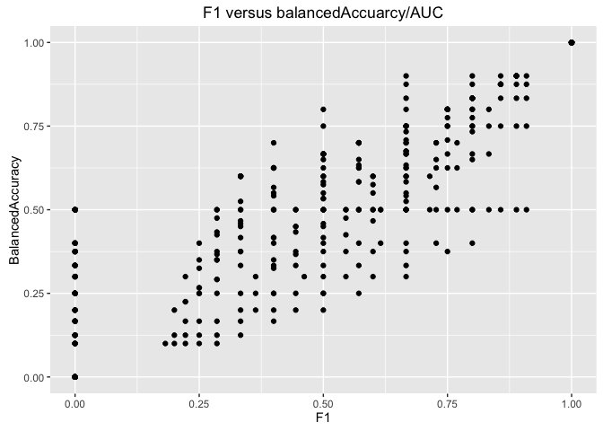
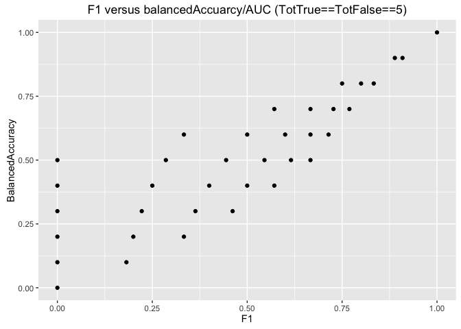

From help("confusionMatrix") {caret}:

              Reference 
    Predicted   Event   No Event
         Event  A       B
      No Event  C       D

Reference is "ground truth" or actual outcome. We will call examples that have true ground truth "true examples" (please don't confuse this with "TrueNegatives" which are "false examples" that are correctly scored as being false.

We can encode what we have written about these confusion matrix summaries as alebraic statements.

``` r
library('rSymPy')
```

    ## Loading required package: rJython

    ## Loading required package: rJava

    ## Loading required package: rjson

``` r
# From help("confusionMatrix") {caret}:
A = Var('TruePositives')
B = Var('FalsePositives')
C = Var('FalseNegatives')
D = Var('TrueNegatives')
# (A+C) and (B+D) are facts about the data, independent of classifier.
Sensitivity = A/(A+C)
Specificity = D/(B+D)
Prevalence = (A+C)/(A+B+C+D)
PPV = (Sensitivity * Prevalence)/((Sensitivity*Prevalence) + ((1-Specificity)*(1-Prevalence)))
NPV = (Specificity * (1-Prevalence))/(((1-Sensitivity)*Prevalence) + ((Specificity)*(1-Prevalence)))
DetectionRate = A/(A+B+C+D)
DetectionPrevalence = (A+B)/(A+B+C+D)
BalancedAccuracy = (Sensitivity+Specificity)/2

# From our slides
TPR = A/(A+C)     # True Positive Rate
FPR = B/(B+D)     # False Positive Rate
FNR = C/(A+C)     # False Negative Rate
TNR = D/(B+D)     # True Negative Rate
Recall = A/(A+C)
Precision = A/(A+B)
```

Obviously: Sensitivity==TPR==Recall. But we can check much more.

``` r
# Examine rules
print(FNR)
```

    ## [1] "FalseNegatives/(FalseNegatives + TruePositives)"

``` r
# Confirm TPR == 1 - FNR
sympy(paste("simplify(",TPR-(1-FNR),")"))
```

    ## [1] "0"

``` r
# Confirm Recall == Sensitivity
sympy(paste("simplify(",Recall-Sensitivity,")"))
```

    ## [1] "0"

``` r
# Confirm Precision != Specificity
sympy(paste("simplify(",Precision-Specificity,")"))
```

    ## [1] "(FalsePositives*TruePositives - FalsePositives*TrueNegatives)/(FalsePositives*TrueNegatives + FalsePositives*TruePositives + TrueNegatives*TruePositives + FalsePositives**2)"

``` r
# Confirm PPV == Precision
sympy(paste("simplify(",PPV-Precision,")"))
```

    ## [1] "0"

Confirm Prob\[score(true)&gt;score(false)\] (with half point on ties) == BalancedAccuracy for Hard Classifier. Reference/Truth/Outcome "True" cases are A and C, "False" cases are B and D. So the odds of drawing an ordered pair where the first is True and the second is False is: (A+C)\*(B+D). There are also four combinations of how a True example and a False example can be scored as a pair:

    A D : True Positive and True Negative: Correct sorting 1 point
    A B : True Positive and False Positive (same prediction "Positive", different outcomes): 1/2 point
    C D : False Negative and True Negative (same prediction "Negative", different outcomes): 1/2 point
    C B : False Negative and True Negative: Wrong order 0 points

The conditional expectation of `Award[score(true)>score(false)]` (1 point if score is right, 1/2 if tie, 0 if wrong) is then given by:

``` r
ScoreTrueGTFalse = (1*A*D  + 0.5*A*B + 0.5*C*D + 0*C*B)/((A+C)*(B+D))
sympy(paste("simplify(",ScoreTrueGTFalse-BalancedAccuracy,")"))
```

    ## [1] "0"

Confirm `Prob[score(true)>score(false)]` (with half point on ties) == AUC. We can compute the AUC of the above confusion matrix by refering to the following diagram.


Then we can check for general equality:

``` r
AUC = (1/2)*FPR*TPR + (1/2)*(1-FPR)*(1-TPR) + (1-FPR)*TPR
sympy(paste("simplify(",ScoreTrueGTFalse-AUC,")"))
```

    ## [1] "0"

This AUC/Score (with half point credit on ties) equivalence holds in general [More on ROC/AUC](http://www.win-vector.com/blog/2013/01/more-on-rocauc/) (though I, John Mount, got this wrong the first time).

F1
==

``` r
# Wikipedia https://en.wikipedia.org/wiki/F1_score
F1 = 2*Precision*Recall/(Precision+Recall)
F1 = sympy(paste("simplify(",F1,")"))
print(F1)
```

    ## [1] "2*TruePositives/(FalseNegatives + FalsePositives + 2*TruePositives)"

``` r
print(BalancedAccuracy)
```

    ## [1] "TrueNegatives/(2*(FalsePositives + TrueNegatives)) + TruePositives/(2*(FalseNegatives + TruePositives))"

``` r
# symbolic substition is very bad way to get values, as it can miss x/0 cases
subSymbolic <- function(expr,
                        TruePositives,FalsePositives,FalseNegatives,TrueNegatives) {
  as.numeric(sympy(paste('float((',expr,').subs({TruePositives:',TruePositives,
              ',FalsePositives:',FalsePositives,
              ',FalseNegatives:',FalseNegatives,
              ',TrueNegatives:',TrueNegatives,'}))')))
}
# bad example: 
subSymbolic(BalancedAccuracy,
            TruePositives=0,FalsePositives=1,FalseNegatives=0,TrueNegatives=1)
```

    ## [1] 0.75

``` r
# better treatment:
sub <- function(expr,
                TruePositives,FalsePositives,FalseNegatives,TrueNegatives) {
  eval(expr)
}
sub(parse(text=BalancedAccuracy),
    TruePositives=0,FalsePositives=1,FalseNegatives=0,TrueNegatives=1)
```

    ## [1] NaN

``` r
print(F1)
```

    ## [1] "2*TruePositives/(FalseNegatives + FalsePositives + 2*TruePositives)"

``` r
print(BalancedAccuracy)
```

    ## [1] "TrueNegatives/(2*(FalsePositives + TrueNegatives)) + TruePositives/(2*(FalseNegatives + TruePositives))"

``` r
# Show F1 and BalancedAccuracy do not always vary together (even for hard classifiers)
F1formula = parse(text=F1)
BAformula = parse(text=BalancedAccuracy)
frm = c()
for(TotTrue in 1:5) {
  for(TotFalse in 1:5) {
    for(TruePositives in 0:TotTrue) {
      for(TrueNegatives in 0:TotFalse) {
        FalsePositives = TotFalse-TrueNegatives
        FalseNegatives = TotTrue-TruePositives
        F1a <- sub(F1formula,
                   TruePositives=TruePositives,FalsePositives=FalsePositives,
                   FalseNegatives=FalseNegatives,TrueNegatives=TrueNegatives)
        BAa <- sub(BAformula,
                   TruePositives=TruePositives,FalsePositives=FalsePositives,
                   FalseNegatives=FalseNegatives,TrueNegatives=TrueNegatives)
        if((F1a<=0)&&(BAa>0.5)) {
          stop()
        }
        fi = data.frame(
          TotTrue=TotTrue,
          TotFalse=TotFalse,
          TruePositives=TruePositives,FalsePositives=FalsePositives,
          FalseNegatives=FalseNegatives,TrueNegatives=TrueNegatives,
          F1=F1a,BalancedAccuracy=BAa,
          stringsAsFactors = FALSE)
        frm = rbind(frm,fi) # bad n^2 accumulation
      }
    }
  }
}

ggplot(data=frm,aes(x=F1,y=BalancedAccuracy)) + 
  geom_point() + 
  ggtitle("F1 versus balancedAccuarcy/AUC")
```



``` r
# mostly we are exploiting changes in prevalence
print(frm[(frm$BalancedAccuracy==0.5) & (max(frm[frm$BalancedAccuracy==0.5,'F1'])==frm$F1),])
```

    ##     TotTrue TotFalse TruePositives FalsePositives FalseNegatives
    ## 291       5        1             5              1              0
    ##     TrueNegatives        F1 BalancedAccuracy
    ## 291             0 0.9090909              0.5

``` r
# but there is some range between the two scores even when 
# we hold that constant (and equal)
f55 = frm[(frm$TotTrue==5) & (frm$TotFalse==5),]
ggplot(data=f55,
       aes(x=F1,y=BalancedAccuracy)) + 
  geom_point() +
  ggtitle("F1 versus balancedAccuarcy/AUC (TotTrue==TotFalse==5)")
```



``` r
# notice in particular a classifier that never says "no"
# can have a non-trivial looking F1 score (but not BalancedAccuracy/AUC)
print(f55[(f55$BalancedAccuracy==0.5) & (max(f55[f55$BalancedAccuracy==0.5,'F1'])==f55$F1),])
```

    ##     TotTrue TotFalse TruePositives FalsePositives FalseNegatives
    ## 395       5        5             5              5              0
    ##     TrueNegatives        F1 BalancedAccuracy
    ## 395             0 0.6666667              0.5

``` r
# For a classifier that never says "no" we have TrueNegatives==FalseNegatives=0
F1Simp =
  sympy(paste(F1,'.subs({FalseNegatives:',0,',TrueNegatives:',0,'})'))
print(F1Simp)
```

    ## [1] "2*TruePositives/(FalsePositives + 2*TruePositives)"

``` r
PrevalenceSimp = 
  sympy(paste(Prevalence,'.subs({FalseNegatives:',0,',TrueNegatives:',0,'})'))
print(PrevalenceSimp)
```

    ## [1] "TruePositives/(FalsePositives + TruePositives)"

``` r
# If X = FalsePositives/TruePositives we have:
X = Var('X')
F1AlwaysYes = 2/(X+2)
PrevalenceAlwaysYes = 1/(X+1)
# confirm substitutions
sympy(paste0('simplify(',F1Simp,
             ' - (',F1AlwaysYes,
             ').subs({X:FalsePositives/TruePositives}))'))
```

    ## [1] "0"

``` r
sympy(paste0('simplify(',PrevalenceSimp,
             ' - (',PrevalenceAlwaysYes,
             ').subs({X:FalsePositives/TruePositives}))'))
```

    ## [1] "0"

``` r
# solve
PrevalenceV = Var('Prevalence')
solns = sympy(paste('solve(',PrevalenceAlwaysYes,'-Prevalence,X)'))
solns = gsub('^\\[','',solns)
solns = gsub('\\]$','',solns)
solns = strsplit(solns,',')[[1]]
for(Xvalue in solns) {
  print(paste("x soln",Xvalue))
  PrevalenceAlwaysYesV = 
    sympy(paste('simplify((',PrevalenceAlwaysYes,').subs({X:',Xvalue,'}))'))
  print(paste("would entail Prevalence: ",PrevalenceAlwaysYesV))
  F1AlwaysYesV = 
    sympy(paste('simplify((',F1AlwaysYes,').subs({X:',Xvalue,'}))'))
  print(paste("would entail F1: ",F1AlwaysYesV))
}
```

    ## [1] "x soln 0"
    ## [1] "would entail Prevalence:  1"
    ## [1] "would entail F1:  1"
    ## [1] "x soln  (1 - Prevalence)/Prevalence"
    ## [1] "would entail Prevalence:  Prevalence"
    ## [1] "would entail F1:  2*Prevalence/(1 + Prevalence)"

``` r
# So F1 is 2*Prevalence/(1 + Prevalence) for classifiers that never say "no."

# confirm
sympy(paste0('simplify(',F1Simp,
             ' - 2*(',PrevalenceSimp,')/(1+(',PrevalenceSimp,')))'))
```

    ## [1] "0"
