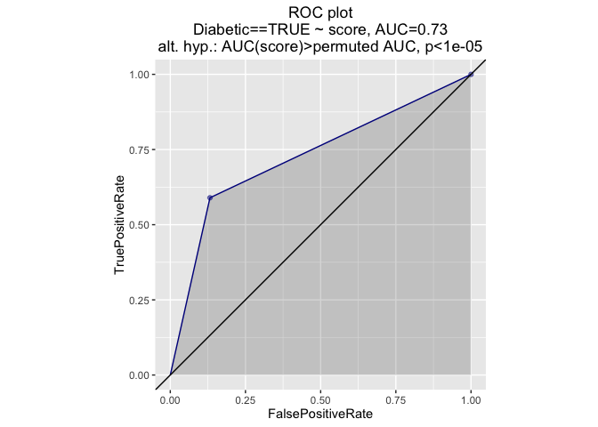

Confusion Matrix derived statistics.

``` r
# set seed to improve reproducibility
set.seed(23525)

# summary data as in slides
diabetesCounts <- data.frame(count=c(434,66,110,158),
                             Diabetic=c(FALSE,FALSE,TRUE,TRUE),
                             Prediction=c(FALSE,TRUE,FALSE,TRUE))

diabetesCounts
```

    ##   count Diabetic Prediction
    ## 1   434    FALSE      FALSE
    ## 2    66    FALSE       TRUE
    ## 3   110     TRUE      FALSE
    ## 4   158     TRUE       TRUE

``` r
# expand data into individuals
#  (essentially the reverse of forming a confusion matrix)
indices <- Reduce(c,lapply(seq_along(diabetesCounts$count),
       function(i) replicate(diabetesCounts$count[i],i)))
# base::sample() is not to be trusted on varying length numeric vectors
#       one fix is to move in and out of list form.
#       For discussion see:
# http://www.win-vector.com/blog/2016/03/sample-monkeys-paw-style-programming-in-r/
indices <- as.numeric(sample(as.list(indices),length(indices)))
diabetesIndvid <- diabetesCounts[indices,]
diabetesIndvid$count <- NULL

head(diabetesIndvid)
```

    ##     Diabetic Prediction
    ## 1      FALSE      FALSE
    ## 3       TRUE      FALSE
    ## 3.1     TRUE      FALSE
    ## 4       TRUE       TRUE
    ## 1.1    FALSE      FALSE
    ## 1.2    FALSE      FALSE

``` r
# summarize using common stat methods
tab <- table(diabetesIndvid)
print(tab)
```

    ##         Prediction
    ## Diabetic FALSE TRUE
    ##    FALSE   434   66
    ##    TRUE    110  158

``` r
fisher.test(tab)
```

    ## 
    ##  Fisher's Exact Test for Count Data
    ## 
    ## data:  tab
    ## p-value < 2.2e-16
    ## alternative hypothesis: true odds ratio is not equal to 1
    ## 95 percent confidence interval:
    ##   6.523196 13.699442
    ## sample estimates:
    ## odds ratio 
    ##   9.409602

``` r
# summarize using caret
library('caret')
```

    ## Loading required package: lattice

``` r
cm <- confusionMatrix(data=diabetesIndvid$Prediction,
                       reference=diabetesIndvid$Diabetic,
                       dnn=c("Prediction","Diabetic"),
                       positive='TRUE')
print(cm)
```

    ## Confusion Matrix and Statistics
    ## 
    ##           Diabetic
    ## Prediction FALSE TRUE
    ##      FALSE   434  110
    ##      TRUE     66  158
    ##                                           
    ##                Accuracy : 0.7708          
    ##                  95% CI : (0.7394, 0.8001)
    ##     No Information Rate : 0.651           
    ##     P-Value [Acc > NIR] : 3.958e-13       
    ##                                           
    ##                   Kappa : 0.4757          
    ##  Mcnemar's Test P-Value : 0.00119         
    ##                                           
    ##             Sensitivity : 0.5896          
    ##             Specificity : 0.8680          
    ##          Pos Pred Value : 0.7054          
    ##          Neg Pred Value : 0.7978          
    ##              Prevalence : 0.3490          
    ##          Detection Rate : 0.2057          
    ##    Detection Prevalence : 0.2917          
    ##       Balanced Accuracy : 0.7288          
    ##                                           
    ##        'Positive' Class : TRUE            
    ## 

``` r
# note: Kappa = (observed accuracy - expected accuracy)/(1 - expected accuracy)
#  Sensitivity == Recall
#  Pos Pred Value == Precision
# help("confusionMatrix")
```

``` r
# Graph ROC plot treating categorical prediction as a numeric score.
# install.packages("devtools")
# devtools::install_github("WinVector/WVPlots",build_vignettes=TRUE)
library(WVPlots)
```

    ## Loading required package: grid

    ## Loading required package: gridExtra

    ## Loading required package: reshape2

    ## Loading required package: plyr

    ## Loading required package: stringr

    ## Loading required package: mgcv

    ## Loading required package: nlme

    ## This is mgcv 1.8-14. For overview type 'help("mgcv-package")'.

    ## Loading required package: sigr

``` r
diabetesIndvid$score = as.numeric(diabetesIndvid$Prediction)
ROCPlot(diabetesIndvid,'score','Diabetic',TRUE,'ROC plot')
```



AUC is also equal to the the probability a "true" example scores higher than a "false" example (both chosen uniformly at random) when ties are counted as 1/2 ( <http://www.win-vector.com/blog/2013/01/more-on-rocauc/> ).

For a classifier that returns two values (a "hard classifier") we also have this same probability is equal to the balanced accuracy. This can be checked through algebra (see below).

``` r
# Compute AUC.
# Warning naive method uses time proportional to the square of the number
# of data rows.
auc <- function(d,scoreVar,truthVar) {
  cuts = sort(unique(d[[scoreVar]]))
  tpr <- function(c) sum( d[[truthVar]] & (d[[scoreVar]]>=c) )/sum(d[[truthVar]])
  fpr <- function(c) sum( (!d[[truthVar]]) & (d[[scoreVar]]>=c) )/sum(!d[[truthVar]])
  tprs <- c(1,vapply(cuts,tpr,numeric(1)),0)
  fprs <- c(1,vapply(cuts,fpr,numeric(1)),0)
  n <- length(tprs)
  # Trapezoidal rule exact for piecewise linear data.
  sum(0.5*(tprs[-n] + tprs[-1])*(fprs[-n]-fprs[-1]))
}


# Compute the probability that a positive example scores above
# a negative example (ties scored as 1/2).
# Warning naive method uses time proportional to the square of the number
# of data rows.
pTgtF <- function(d,scoreVar,truthVar) {
  tIdxs <- which(d[[truthVar]])
  fIdxs <- which(!d[[truthVar]])
  tot <- 0.0
  for(i in tIdxs) {
    for(j in fIdxs) {
      if(d[[scoreVar]][i]>=d[[scoreVar]][j]) {
        if(d[[scoreVar]][i]>d[[scoreVar]][j]) {
          tot <- tot + 1.0
        } else {
          tot <- tot + 0.5
        }
      }
    }
  }
  tot/(length(tIdxs)*length(fIdxs))
}

print(paste("auc",auc(diabetesIndvid,'score','Diabetic')))
```

    ## [1] "auc 0.728776119402985"

``` r
print(paste("P[score|true] > P[score|false]",pTgtF(diabetesIndvid,'score','Diabetic')))
```

    ## [1] "P[score|true] > P[score|false] 0.728776119402985"

``` r
print(paste("Balanced Accuracy",cm$byClass['Balanced Accuracy']))
```

    ## [1] "Balanced Accuracy 0.728776119402985"
