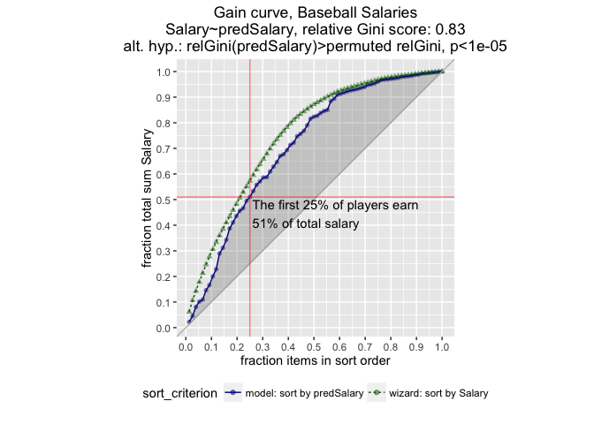
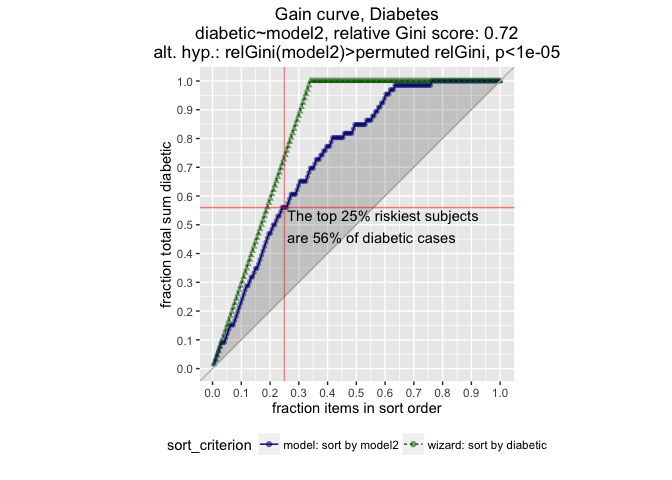

Demonstration code for gain plots

First, load all libraries needed for the examples

``` r
library(vtreat) # for variable treatment
# install.packages("devtools")
# devtools::install_github("WinVector/WVPlots",build_vignettes=TRUE)
library(WVPlots)

# set the random number generator seed, so the random assignments are the same every time
set.seed(45433622) 
```

Regression Example.
===================

We will use the Baseball Salaries data, and predict log (base 10) salary via linear regression. The goal is to identify the highest-paid players efficiently.

First, load the data and build the model

``` r
# load data
salaryData = readRDS("salaryData.rds")

# set the outcome variable, and the input variables
outcome = "logSalary"
vars = setdiff(colnames(salaryData), c("Salary", "Player", "logSalary"))

nr = nrow(salaryData)
# make the train/test assignments (set aside 25% of the data for test)
isTest = runif(nr)<=0.25

# split the data
test = salaryData[isTest,]
train = salaryData[!isTest, ]

salaryData$isTest = isTest  # put the test marker back in the data, for reproducibility

# train the linear regression model
fmla = paste(outcome, "~", paste(vars, collapse="+")) # set up the variables
model1 = lm(fmla, data=train)
summary(model1)
```

    ## 
    ## Call:
    ## lm(formula = fmla, data = train)
    ## 
    ## Residuals:
    ##      Min       1Q   Median       3Q      Max 
    ## -1.09000 -0.12836 -0.01524  0.14299  0.55490 
    ## 
    ## Coefficients:
    ##                           Estimate Std. Error t value Pr(>|t|)    
    ## (Intercept)              2.2631291  0.1210689  18.693  < 2e-16 ***
    ## batting_average          0.8327396  0.9743267   0.855  0.39357    
    ## OBP                     -1.1435733  0.8556458  -1.337  0.18263    
    ## runs                    -0.0010018  0.0020816  -0.481  0.63075    
    ## hits                     0.0035977  0.0012131   2.966  0.00332 ** 
    ## doubles                 -0.0031576  0.0032206  -0.980  0.32784    
    ## triples                 -0.0122794  0.0082382  -1.491  0.13737    
    ## homeruns                 0.0054996  0.0047118   1.167  0.24427    
    ## RBI                      0.0025508  0.0019029   1.340  0.18135    
    ## walks                    0.0033186  0.0016985   1.954  0.05186 .  
    ## strikeouts              -0.0018785  0.0007916  -2.373  0.01842 *  
    ## stolenbases              0.0029310  0.0017296   1.695  0.09142 .  
    ## errors                  -0.0049083  0.0028484  -1.723  0.08612 .  
    ## free_agency_eligibility  0.6521692  0.0413078  15.788  < 2e-16 ***
    ## free_agent_in_1991_2    -0.0704410  0.0498863  -1.412  0.15921    
    ## arbitration_eligibility  0.5667131  0.0460688  12.301  < 2e-16 ***
    ## arbitration_in_1991_2   -0.0542029  0.0914759  -0.593  0.55404    
    ## ---
    ## Signif. codes:  0 '***' 0.001 '**' 0.01 '*' 0.05 '.' 0.1 ' ' 1
    ## 
    ## Residual standard error: 0.2287 on 244 degrees of freedom
    ## Multiple R-squared:  0.8147, Adjusted R-squared:  0.8025 
    ## F-statistic: 67.04 on 16 and 244 DF,  p-value: < 2.2e-16

``` r
# make the predictions on the salaryData frame
salPred = predict(model1, newdata=salaryData)

# set up a frame with the outcomes
perf = data.frame(logSalary = salaryData[[outcome]], 
                  Salary = salaryData$Salary,
                  pred = salPred, isTest=salaryData$isTest,
                  predSalary = 10^salPred)

perfTrain = perf[!isTest,]
perfTest = perf[isTest,]
```

The Gain Curve
--------------

We'll plot the gain curve for the model's performance on the test set. The units will be fractions of salary (not log salary). We'll also annotate the graph to mark what fraction of total salary earned was earned by the first 25% of players, as sorted by the model.

For this model, the players in the highest quartile of predicted salary earn just over half the money earned by all players in the league, twice what you expect from selecting players at random.

``` r
gainx = 0.25  # get the first 25% of players as sorted by the model

tmpfun = function(gx, gy) {
  pctx = gx*100
  pcty = gy*100
  
  paste("The first ", pctx, "% of players earn\n",
        pcty, "% of total salary", sep='')
}

GainCurvePlotWithNotation(perfTest, "predSalary", "Salary", "Baseball Salaries", gainx, tmpfun) 
```



Classification (Class probabilities)
====================================

Here, we build a logistic regression model to predict the onset of diabetes within 5 years. The goal is to identify the most at-risk subjects efficiently.

Task: Predict the onset of diabetes within 5 years

Load the data and fit the model.

``` r
d = read.table("pima-indians-diabetes.data.txt", header=FALSE, sep=",", stringsAsFactors=FALSE)

# 1. Number of times pregnant
# 2. Plasma glucose concentration a 2 hours in an oral glucose tolerance test
# 3. Diastolic blood pressure (mm Hg)
# 4. Triceps skin fold thickness (mm)
# 5. 2-Hour serum insulin (mu U/ml)
# 6. Body mass index (weight in kg/(height in m)^2)
# 7. Diabetes pedigree function
# 8. Age (years)
# 9. Class variable (0 or 1)

colnames(d) = c("npregnant",
             "glucose",
             "blood_pressure",
             "tricep_skin_fold_thickness",
             "insulin",
             "bmi",
             "diabetes_pedigree",
             "age",
             "diabetic")  # 1=diagnosed as diabetic within 5 years/0=not diagnosed after 5 years
d$diabetic = d$diabetic>0.5 # switch outcome to logical

#
# Find missing data. Note: although the dataset donors claim there are no missing values, some of the zeros are clearly actually #  # missing values. I am going to treat 0 as 'missing' for glucose, blood_pressure, skin fold thickness, and bmi.
#

zero_as_missing = c("glucose",
             "blood_pressure",
             "tricep_skin_fold_thickness",
             "bmi")
leave = setdiff(colnames(d), zero_as_missing)

d0 = as.data.frame(lapply(d[,zero_as_missing], 
                          FUN=function(x) ifelse(x==0, NA, x)))

d = cbind(d[,leave], d0)

#
# Set outcome and iput variables, split into training and test
#
yColumn = 'diabetic'
vars = setdiff(colnames(d),c(yColumn, "isTest", "dataLabel"))
d$isTest = runif(nrow(d))<0.25
d$dataLabel = ifelse(d$isTest,"test data","train data")


# Now treat the missing values, by substituting mean value for them
# and adding an additional informational column. We will use the vtreat library
# to do this.
 

dtrain = d[!d$isTest, ]
treatPlan = designTreatmentsC(dtrain, vars, yColumn, TRUE, verbose=FALSE)

dtrainTreat = prepare(treatPlan, dtrain, pruneSig=NULL, doCollar=FALSE)
# the treated data has all NAs replaced by the mean value of the variable,
# and additional columns to mark which values were formerly NAs
head(dtrainTreat)
```

    ##   npregnant_clean insulin_clean diabetes_pedigree_clean age_clean
    ## 1               6             0                   0.627        50
    ## 2               1             0                   0.351        31
    ## 3               8             0                   0.672        32
    ## 4               1            94                   0.167        21
    ## 5               0           168                   2.288        33
    ## 6               3            88                   0.248        26
    ##   glucose_clean glucose_isBAD blood_pressure_clean blood_pressure_isBAD
    ## 1           148             0                   72                    0
    ## 2            85             0                   66                    0
    ## 3           183             0                   64                    0
    ## 4            89             0                   66                    0
    ## 5           137             0                   40                    0
    ## 6            78             0                   50                    0
    ##   tricep_skin_fold_thickness_clean tricep_skin_fold_thickness_isBAD
    ## 1                         35.00000                                0
    ## 2                         29.00000                                0
    ## 3                         29.45477                                1
    ## 4                         23.00000                                0
    ## 5                         35.00000                                0
    ## 6                         32.00000                                0
    ##   bmi_clean bmi_isBAD diabetic
    ## 1      33.6         0     TRUE
    ## 2      26.6         0    FALSE
    ## 3      23.3         0     TRUE
    ## 4      28.1         0    FALSE
    ## 5      43.1         0     TRUE
    ## 6      31.0         0     TRUE

``` r
# get the new variable names
newvars = setdiff(colnames(dtrainTreat), yColumn)

# Train the model (glm)

fmla = paste(yColumn, "~", paste(newvars, collapse="+"))
model2 = glm(fmla, data=dtrainTreat, family=binomial(link="logit"))
summary(model2)
```

    ## 
    ## Call:
    ## glm(formula = fmla, family = binomial(link = "logit"), data = dtrainTreat)
    ## 
    ## Deviance Residuals: 
    ##     Min       1Q   Median       3Q      Max  
    ## -2.7342  -0.7147  -0.4049   0.7300   2.4287  
    ## 
    ## Coefficients:
    ##                                   Estimate Std. Error z value Pr(>|z|)    
    ## (Intercept)                      -9.264862   0.960472  -9.646  < 2e-16 ***
    ## npregnant_clean                   0.112378   0.038030   2.955  0.00313 ** 
    ## insulin_clean                    -0.001314   0.001069  -1.229  0.21902    
    ## diabetes_pedigree_clean           1.147632   0.364450   3.149  0.00164 ** 
    ## age_clean                         0.010872   0.011047   0.984  0.32504    
    ## glucose_clean                     0.038085   0.004562   8.348  < 2e-16 ***
    ## glucose_isBAD                     0.726099   1.152082   0.630  0.52853    
    ## blood_pressure_clean             -0.011257   0.009958  -1.130  0.25831    
    ## blood_pressure_isBAD              1.281924   0.568307   2.256  0.02409 *  
    ## tricep_skin_fold_thickness_clean  0.003952   0.016076   0.246  0.80583    
    ## tricep_skin_fold_thickness_isBAD  0.101339   0.289097   0.351  0.72594    
    ## bmi_clean                         0.098269   0.020989   4.682 2.84e-06 ***
    ## bmi_isBAD                        -1.877990   1.148840  -1.635  0.10212    
    ## ---
    ## Signif. codes:  0 '***' 0.001 '**' 0.01 '*' 0.05 '.' 0.1 ' ' 1
    ## 
    ## (Dispersion parameter for binomial family taken to be 1)
    ## 
    ##     Null deviance: 744.62  on 573  degrees of freedom
    ## Residual deviance: 533.78  on 561  degrees of freedom
    ## AIC: 559.78
    ## 
    ## Number of Fisher Scoring iterations: 5

``` r
# Make predictions

# treat all the data first
dTreat = prepare(treatPlan, d, pruneSig=NULL, doCollar=FALSE)

# put the predictions back into the original frame
d$model2 = predict(model2, newdata=dTreat, type='response')

dtrain = d[!d$isTest,]
dtest = d[d$isTest,]
```

The Gain Curve
--------------

Again, we'll annotate the graph to mark what fraction of diabetics were identified by the top 25% riskiest subjects, as sorted by the model.

The highest-risk quartile of subjects according to the model comprise 57% of the subjects who developed diabetes within 5 years.

``` r
gainx = 0.25  # get the first 25% riskiest subjects as sorted by the model

tmpfun = function(gx, gy) {
  pctx = gx*100
  pcty = gy*100
  
  paste("The top ", pctx, "% riskiest subjects\n",
        "are ", pcty, "% of diabetic cases", sep='')
}

GainCurvePlotWithNotation(dtest, "model2", "diabetic", "Diabetes", gainx, tmpfun) 
```


