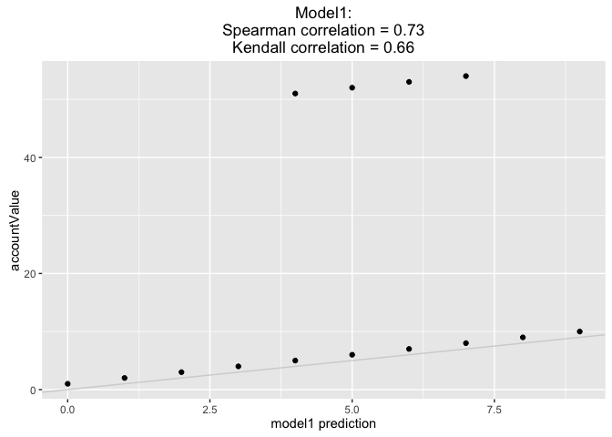
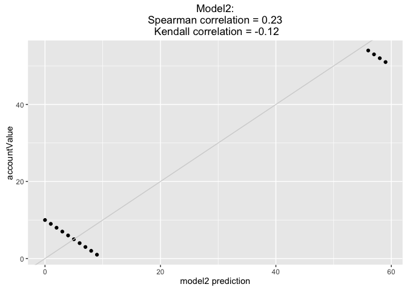
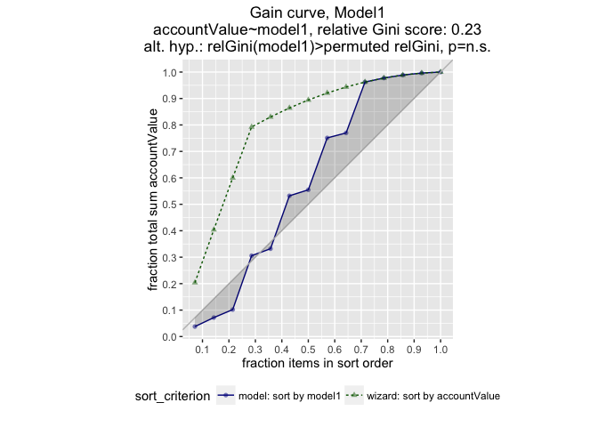
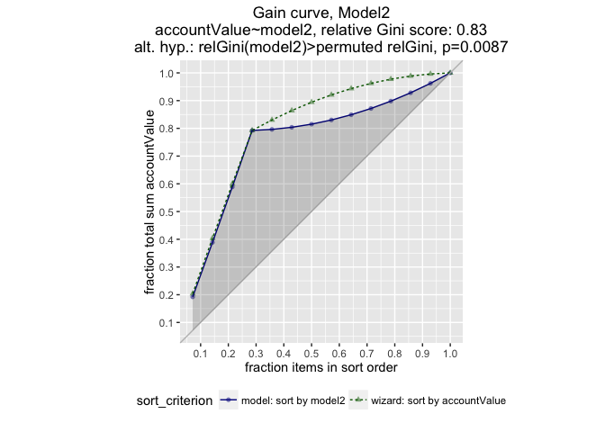

Create the data.

``` r
library('ggplot2')
# install.packages("devtools")
# devtools::install_github("WinVector/WVPlots",build_vignettes=TRUE)
library("WVPlots")
nA = 10
nB = 4

d = data.frame(group=c(rep('a',nA),rep('b',nB)),
               accountValue=c(seq_len(nA),50+seq_len(nB)),
                       stringsAsFactors = FALSE)
d$model1 = (d$accountValue-1) %% 10 + ifelse(d$group=='b',4,0)
d$model2 = (100- d$accountValue) %% 10 + ifelse(d$group=='b',50,0)
```

Plot predictions and rank correlations against true account values. Model1 looks better.

``` r
s1 = format(cor(d$model1,d$accountValue,method='spearman'), digits=2)
k1 = format(cor(d$model1,d$accountValue,method='kendall'), digits=2)

s2 = format(cor(d$model2,d$accountValue,method='spearman'), digits=2)
k2 = format(cor(d$model2,d$accountValue,method='kendall'), digits=2)

title1 = paste("Model1:\n", "Spearman correlation =", s1, "\nKendall correlation =", k1)
title2 = paste("Model2:\n", "Spearman correlation =", s2, "\n Kendall correlation =", k2)

ggplot(data=d,mapping=aes(x=model1,y=accountValue)) + 
  geom_point() + ggtitle(title1) + xlab("model1 prediction") +
  geom_abline(color="lightgray")
```



``` r
ggplot(data=d,mapping=aes(x=model2,y=accountValue)) + 
  geom_point() + ggtitle(title2) + xlab("model2 prediction") +
  geom_abline(color="lightgray")
```



Plot gain curve of predictions against true account values. Model2 looks better.

``` r
GainCurvePlot(d,'model1','accountValue','Model1')
```



``` r
GainCurvePlot(d,'model2','accountValue','Model2')
```



Linear correlations of predictions against true account values. Model2 looks better.

``` r
p1 = format(cor(d$model1,d$accountValue,method='pearson'), digits=2)
p2 = format(cor(d$model2,d$accountValue,method='pearson'), digits=2)
# Could also call cor.test() for significance, but that isn't the core of the issue.

print(paste("Linear correlations of model predictions to account values -- model1:", p1, ", model2:", p2))
```

    ## [1] "Linear correlations of model predictions to account values -- model1: 0.29 , model2: 0.98"
