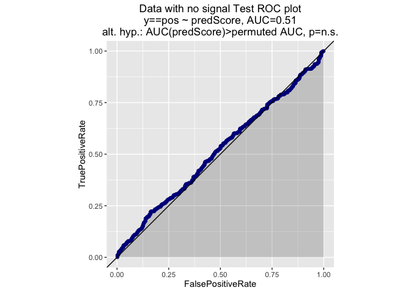
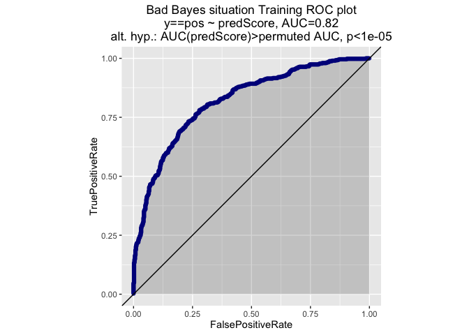
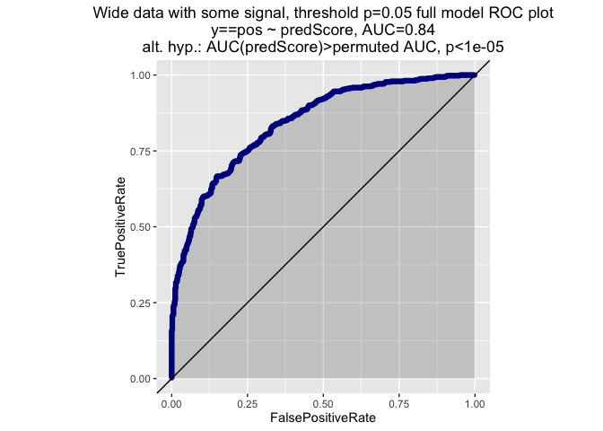
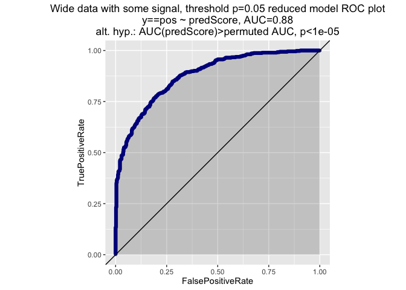
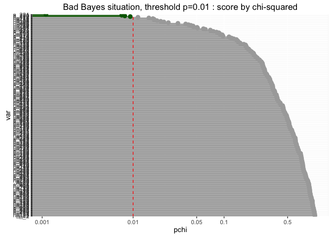
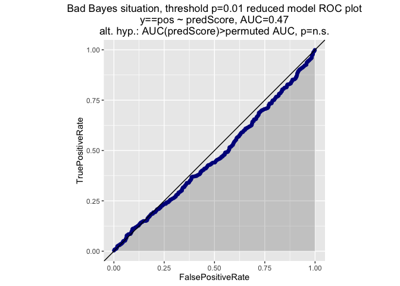

For simplicity, we will do this all with glm, and mostly with deviance, but in theory this method will determine model significance for any modeling method and any metric. However, for variable selection, you might as well use a simple and easy to run modeling method like glm or lm, regardless of what your final modeling algorithm will be. In fact, permutation tests with lm can be made very efficient, because you are keeping the same design matrix and only changing the y vector.

``` r
source("functions.R")
# install.packages("devtools")
# devtools::install_github("WinVector/WVPlots",build_vignettes=TRUE)
library("WVPlots")
```

    ## Loading required package: ggplot2

    ## Loading required package: grid

    ## Loading required package: gridExtra

    ## Loading required package: reshape2

    ## Loading required package: plyr

    ## Loading required package: stringr

    ## Loading required package: mgcv

    ## Loading required package: nlme

    ## This is mgcv 1.8-14. For overview type 'help("mgcv-package")'.

    ## Loading required package: sigr

``` r
set.seed(12959437)
```

Some Examples of Estimating Model Significance
----------------------------------------------

### A case with signal

``` r
# clean data
run_example(ngood=10, nnoise=3,
            datasize=1000, nperm=500, 'Data with signal')
```

    ## [1] "True coefficients of signal variables"
    ##        g_1        g_2        g_3        g_4        g_5        g_6 
    ##  2.2137823  0.7404727  1.5618447 -0.1593522 -0.2512571  0.3290297 
    ##        g_7        g_8        g_9       g_10 
    ##  0.5927275  0.5463776 -1.0104262 -0.7135154 
    ## [1] "Data with signal : training prevalence =  0.488 null deviance of mean = 1385.71830581115"


    ## [1] "Compare training and test performance estimates, Data with signal"
    ##   deviance                     label
    ## 1 399.0531 Data with signal Training
    ## 2 457.1625     Data with signal Test
    ## [1] "Training performance compared to permutation test results"
    ##    Min. 1st Qu.  Median    Mean 3rd Qu.    Max. 
    ##    1349    1369    1373    1373    1377    1383 
    ## [1] "Left tail area, deviance 0"


### A case with no signal

``` r
run_example(ngood=0, nnoise=10,
            datasize=1000, nperm=500, 'Data with no signal')
```

    ## [1] "Data with no signal : training prevalence =  0.505 null deviance of mean = 1386.19435945316"



    ## [1] "Compare training and test performance estimates, Data with no signal"
    ##   deviance                        label
    ## 1 1368.208 Data with no signal Training
    ## 2 1398.970     Data with no signal Test
    ## [1] "Training performance compared to permutation test results"
    ##    Min. 1st Qu.  Median    Mean 3rd Qu.    Max. 
    ##    1358    1374    1377    1376    1379    1384 
    ## [1] "Left tail area, deviance 0.052"


### Bad Bayes: very wide data with no signal

``` r
run_example(ngood=0, nnoise=300, 
            datasize=1000, nperm=200, 'Bad Bayes situation')
```

    ## [1] "Bad Bayes situation : training prevalence =  0.502 null deviance of mean = 1386.27836107722"



    ## [1] "Compare training and test performance estimates, Bad Bayes situation"
    ##   deviance                        label
    ## 1 1040.921 Bad Bayes situation Training
    ## 2 2101.082     Bad Bayes situation Test
    ## [1] "Training performance compared to permutation test results"
    ##    Min. 1st Qu.  Median    Mean 3rd Qu.    Max. 
    ##   911.7  1008.0  1029.0  1027.0  1048.0  1098.0 
    ## [1] "Left tail area, deviance 0.66"


Using model significance (chi-squared test) to select variables.
----------------------------------------------------------------

### Data with signal

``` r
run_vs_example(ngood=10, nnoise=20,
               datasize=1000, nperm=200,
               threshold=0.05, 'Data with signal, threshold p=0.05')
```


    ## [1] "Coefficients of true signal variables:"
    ##         g_1         g_2         g_3         g_4         g_5         g_6 
    ## -1.19547881 -1.07062960  1.72491030 -1.00080352  0.54413502 -1.21773138 
    ##         g_7         g_8         g_9        g_10 
    ##  0.01662549  0.34254521 -0.65799357 -0.05733356 
    ## [1] "Selected variables (permutation):"
    ## [1] "g_1" "g_2" "g_3" "g_4" "g_5" "g_6" "g_8" "g_9"
    ## [1] "Selected variables (chi-squared):"
    ## [1] "g_1" "g_2" "g_3" "g_4" "g_5" "g_6" "g_8" "g_9"
    ## [1] " ========= Compare full and reduced models (holdout performance) =========="


    ##   deviance                                            label
    ## 1 522.0049    Data with signal, threshold p=0.05 full model
    ## 2 503.8607 Data with signal, threshold p=0.05 reduced model

### Wider data with some signal

``` r
run_vs_example(ngood=5, nnoise=100,
               datasize=1000, nperm=200,
               threshold=0.05, 'Wide data with some signal, threshold p=0.05')
```


    ## [1] "Coefficients of true signal variables:"
    ##         g_1         g_2         g_3         g_4         g_5 
    ## -0.10628577  0.05610456 -0.66233581 -0.18929396  1.17184538 
    ## [1] "Selected variables (permutation):"
    ## [1] "g_3"  "g_4"  "g_5"  "n_13" "n_17" "n_41"
    ## [1] "Selected variables (chi-squared):"
    ## [1] "g_3"  "g_4"  "g_5"  "n_13" "n_41" "n_79" "n_94"
    ## [1] " ========= Compare full and reduced models (holdout performance) =========="



    ##    deviance                                                      label
    ## 1 1073.1865    Wide data with some signal, threshold p=0.05 full model
    ## 2  868.7597 Wide data with some signal, threshold p=0.05 reduced model

### Data with no signal

You would expect a threshold of 0.05 (or 1/20) to let about one out of every twenty noise variables to slip by. This gives you a rule of thumb for picking the threshold.

``` r
# scoring columns, data with no signal
nnoise = 100
p=0.05
# the number of bad variables to expect
print(nnoise*p)
```

    ## [1] 5

``` r
run_vs_example(ngood=0, nnoise=nnoise,
               datasize=1000, nperm=200,
               threshold=p, 'Data with no signal, threshold p=0.05')
```


    ## [1] "Selected variables (permutation):"
    ## [1] "n_2"  "n_17" "n_22"
    ## [1] "Selected variables (chi-squared):"
    ## [1] "n_2"  "n_17" "n_22" "n_91"
    ## [1] " ========= Compare full and reduced models (holdout performance) =========="


    ##   deviance                                               label
    ## 1 1580.967    Data with no signal, threshold p=0.05 full model
    ## 2 1413.463 Data with no signal, threshold p=0.05 reduced model

### Bad Bayes

``` r
nnoise=300
p=0.01
# the number of bad variables to expect
print(nnoise*p)
```

    ## [1] 3

``` r
run_vs_example(ngood=0, nnoise=nnoise, 
            datasize=1000, nperm=200, 
            threshold=p, 'Bad Bayes situation, threshold p=0.01')
```



    ## [1] "Selected variables (permutation):"
    ## [1] "n_112" "n_220" "n_221"
    ## [1] "Selected variables (chi-squared):"
    ## [1] "n_112" "n_190" "n_220" "n_221"
    ## [1] " ========= Compare full and reduced models (holdout performance) =========="



    ##   deviance                                               label
    ## 1 2112.860    Bad Bayes situation, threshold p=0.01 full model
    ## 2 1431.091 Bad Bayes situation, threshold p=0.01 reduced model
