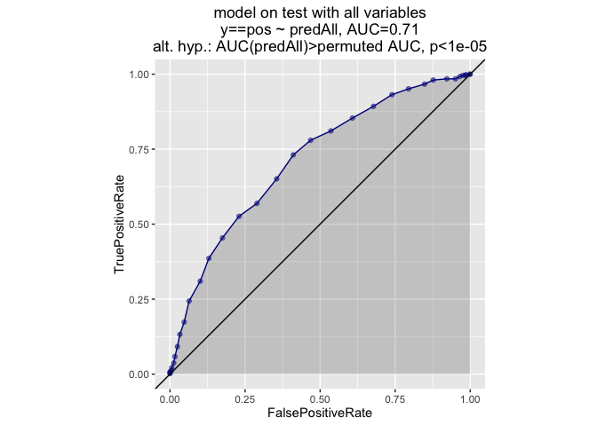
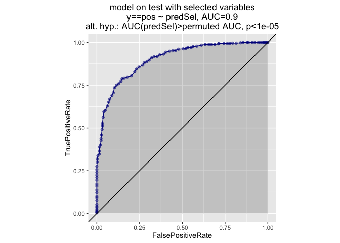

``` r
library('ggplot2')
library('vtreat')
library('randomForest')
```

    ## randomForest 4.6-12

    ## Type rfNews() to see new features/changes/bug fixes.

    ## 
    ## Attaching package: 'randomForest'

    ## The following object is masked from 'package:ggplot2':
    ## 
    ##     margin

``` r
source("functions.R")
# install.packages("devtools")
# devtools::install_github("WinVector/WVPlots",build_vignettes=TRUE)
library("WVPlots")
```

    ## Loading required package: grid

    ## Loading required package: gridExtra

    ## 
    ## Attaching package: 'gridExtra'

    ## The following object is masked from 'package:randomForest':
    ## 
    ##     combine

    ## Loading required package: reshape2

    ## Loading required package: plyr

    ## Loading required package: stringr

    ## Loading required package: mgcv

    ## Loading required package: nlme

    ## This is mgcv 1.8-14. For overview type 'help("mgcv-package")'.

    ## Loading required package: sigr

``` r
set.seed(12959437)
coefs = mkCoefs(20)
nnoise = 2000
dTrain = mkData(1000, coefs, nnoise)
vars <- setdiff(colnames(dTrain),'y')
dCal = mkData(1000, coefs, nnoise)
dTest = mkData(1000, coefs, nnoise)

cl = parallel::makeCluster(parallel::detectCores())
treatments <- vtreat::designTreatmentsC(dCal,vars,'y','pos',
                                        parallelCluster=cl,
                                        verbose=FALSE)
if(!require('dplyr')) {
  scores <- aggregate(sig~origName,treatments$scoreFrame,FUN=min)
  selectedVars <- sort(scores[scores$sig<=1/length(vars),'origName'])
} else {
  treatments$scoreFrame %>% group_by(origName) %>% summarize(sig=min(sig)) %>%
    filter(sig<=1/length(vars)) -> scores
  selectedVars = sort(scores$origName)
}
```

    ## Loading required package: dplyr

    ## 
    ## Attaching package: 'dplyr'

    ## The following object is masked from 'package:nlme':
    ## 
    ##     collapse

    ## The following objects are masked from 'package:plyr':
    ## 
    ##     arrange, count, desc, failwith, id, mutate, rename, summarise,
    ##     summarize

    ## The following object is masked from 'package:gridExtra':
    ## 
    ##     combine

    ## The following object is masked from 'package:randomForest':
    ## 
    ##     combine

    ## The following objects are masked from 'package:stats':
    ## 
    ##     filter, lag

    ## The following objects are masked from 'package:base':
    ## 
    ##     intersect, setdiff, setequal, union

``` r
print(selectedVars)
```

    ##  [1] "g_1"    "g_10"   "g_12"   "g_13"   "g_14"   "g_16"   "g_17"  
    ##  [8] "g_19"   "g_3"    "g_7"    "g_9"    "n_1171" "n_686"

``` r
dPlot <- dTest[,'y',drop=FALSE]

dBoth <- rbind(dTrain,dCal)
mAll <- randomForest(x=dBoth[,vars,drop=FALSE],
                     y=as.factor(dBoth$y),
                     ntree=100)
dPlot$predAll <- predict(mAll,newdata=dTest,type='prob')[,'pos',drop=TRUE]

# We suggest not using the same data for training and treatment.
mSel <- randomForest(x=dTrain[,selectedVars,drop=FALSE],
                     y=as.factor(dTrain$y),
                     ntree=100)
dPlot$predSel <- predict(mSel,newdata=dTest,type='prob')[,'pos',drop=TRUE]

ROCPlot(dPlot,'predAll','y','pos','model on test with all variables')
```



``` r
ROCPlot(dPlot,'predSel','y','pos','model on test with selected variables')
```



``` r
if(!is.null(cl)) {
    parallel::stopCluster(cl)
    cl = NULL
}
```
