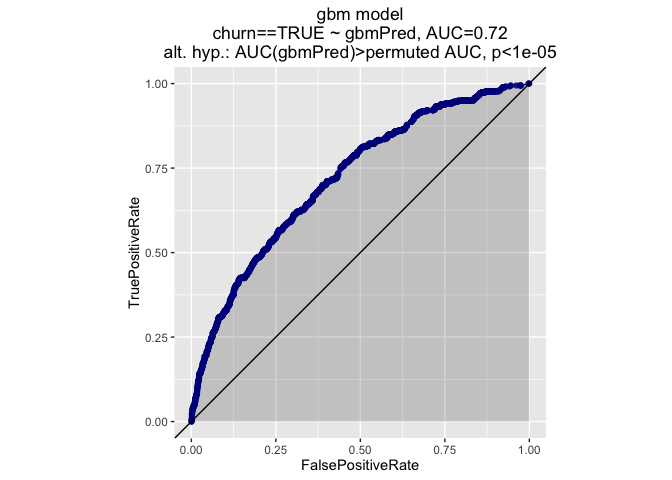
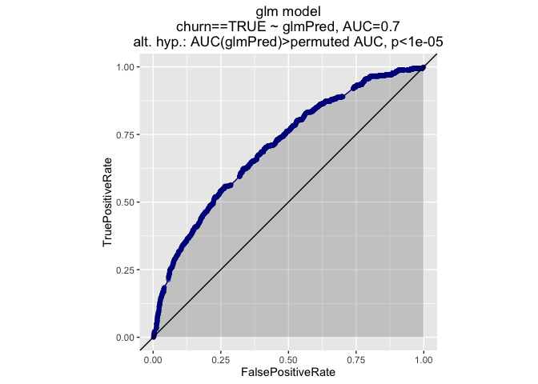
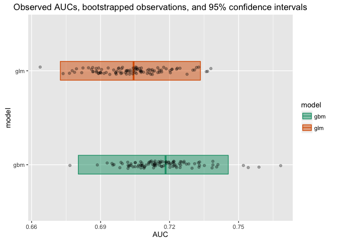
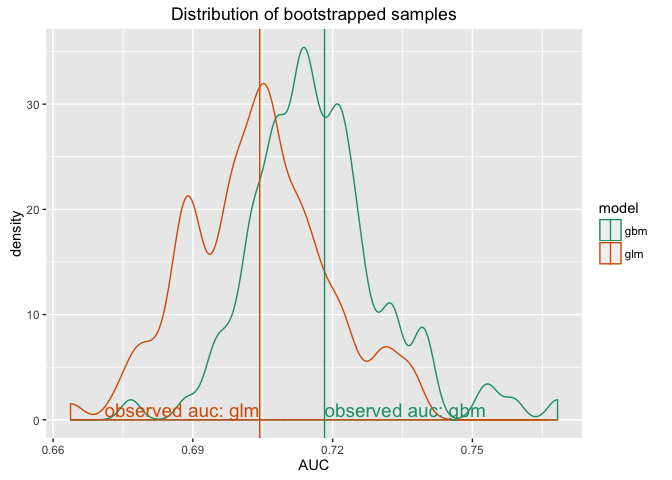
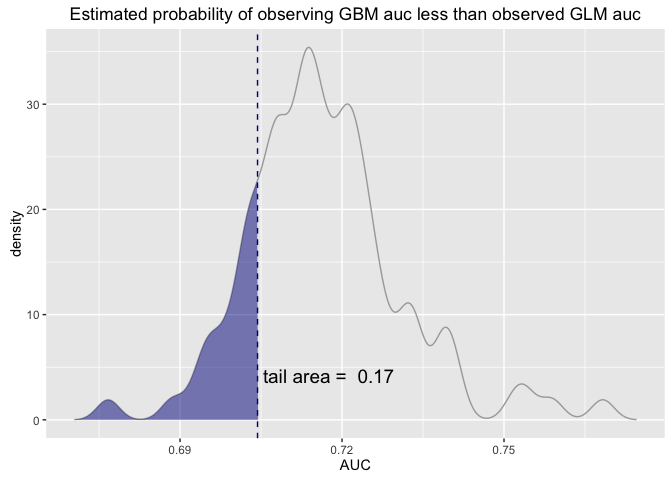
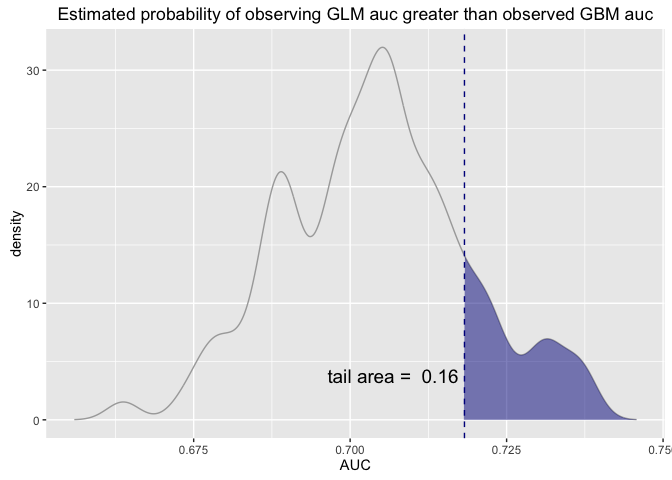
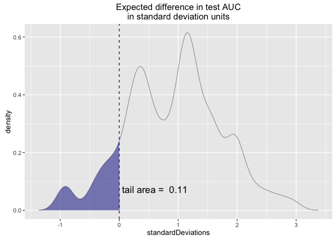

Example task: compare two models and decide which (or if) one is better
-----------------------------------------------------------------------

Load some example scored data. See <https://github.com/WinVector/zmPDSwR/tree/master/KDD2009> for details.

``` r
# Load two models scored on test data from KDD2009 example
# path <- 'https://raw.githubusercontent.com/WinVector/zmPDSwR/master/KDD2009/treatedTestP.tsv'
path <- 'treatedTestP.tsv'
testD <- read.table(path,header=TRUE,sep="\t",
                    stringsAsFactors = FALSE,strip.white = TRUE)
print(head(testD))
```

    ##   churn    gbmPred    glmPred
    ## 1 FALSE 0.05639359 0.02530972
    ## 2 FALSE 0.08601270 0.04716156
    ## 3 FALSE 0.09196478 0.08167178
    ## 4 FALSE 0.05855665 0.07303750
    ## 5 FALSE 0.05863380 0.08079715
    ## 6 FALSE 0.06339721 0.24691037

Plot the ROC/AUC for the gbm model of churn.

``` r
# install.packages("devtools")
# devtools::install_github("WinVector/WVPlots",build_vignettes=TRUE)
library("WVPlots")
source('functions.R')

ROCPlot(testD,'gbmPred','churn',TRUE,'gbm model')
```



``` r
gbmAUC = as.numeric(pROC::auc(testD$churn,testD$gbmPred))
print(gbmAUC)
```

    ## [1] 0.7182652

Plot the ROC/AUC for the glm model of churn.

``` r
ROCPlot(testD,'glmPred','churn',TRUE,'glm model')
```



``` r
glmAUC = as.numeric(pROC::auc(testD$churn,testD$glmPred))
print(glmAUC)
```

    ## [1] 0.7043481

GBM has a higher AUC, so appears to perform better.

Question: are these two AUCs actually signficantly different?
-------------------------------------------------------------

To address this we bootstrap sample evaluation sets of the same size as our evaluation set and look at the distribution of reported scores. Note that this procedure does not involve refitting the models (or even reapplying them), so it is not too computationally demanding.

See <http://www.statmethods.net/advstats/bootstrapping.html> and <https://cran.r-project.org/doc/Rnews/Rnews_2002-3.pdf> for details.

``` r
library('boot')
```

    ## 
    ## Attaching package: 'boot'

    ## The following object is masked from 'package:lattice':
    ## 
    ##     melanoma

``` r
library('ggplot2')

set.seed(24627)

bs <- function(data, indices, scoreColumn) {
  d <- data[indices,]
  return(pROC::auc(d$churn,d[[scoreColumn]]))
}

resultsGLM <- boot(data=testD, statistic=bs, 
    R=100,
    parallel='snow', ncpus=parallel::detectCores(),
    scoreColumn = 'glmPred')

bci = boot.ci(resultsGLM,type='basic')
print(bci)
```

    ## BOOTSTRAP CONFIDENCE INTERVAL CALCULATIONS
    ## Based on 100 bootstrap replicates
    ## 
    ## CALL : 
    ## boot.ci(boot.out = resultsGLM, type = "basic")
    ## 
    ## Intervals : 
    ## Level      Basic         
    ## 95%   ( 0.6725,  0.7334 )  
    ## Calculations and Intervals on Original Scale
    ## Some basic intervals may be unstable

``` r
glmDev = sd(resultsGLM$t)
print(glmDev)
```

    ## [1] 0.0149033

``` r
ciGLM = bci$basic[, 4:5]

resultsGBM <- boot(data=testD, statistic=bs, 
    R=100,
    parallel='snow', ncpus=parallel::detectCores(),
    scoreColumn = 'gbmPred')

bci = boot.ci(resultsGBM,type='basic')
print(bci)
```

    ## BOOTSTRAP CONFIDENCE INTERVAL CALCULATIONS
    ## Based on 100 bootstrap replicates
    ## 
    ## CALL : 
    ## boot.ci(boot.out = resultsGBM, type = "basic")
    ## 
    ## Intervals : 
    ## Level      Basic         
    ## 95%   ( 0.6803,  0.7455 )  
    ## Calculations and Intervals on Original Scale
    ## Some basic intervals may be unstable

``` r
gbmDev = sd(resultsGBM$t)
print(gbmDev)
```

    ## [1] 0.01458811

``` r
ciGBM = bci$basic[,4:5]

# auc
pd <- rbind(data.frame(AUC=resultsGLM$t[,1],
                       model='glm',
                       stringsAsFactors = FALSE),
            data.frame(AUC=resultsGBM$t[,1],
                       model='gbm',
                       stringsAsFactors = FALSE))
# observations
mk <- data.frame(AUC=c(glmAUC,gbmAUC),
                 model=c('glm','gbm'),
                 stringsAsFactors = FALSE)

# confidence intervals
ci = as.data.frame(rbind(ciGLM, ciGBM)) 
colnames(ci) = c("lower", "upper")
ci$model= c('glm', 'gbm')

# merge the observed AUC and the confidence intervals
ci = merge(ci, mk)
print(ci)
```

    ##   model     lower     upper       AUC
    ## 1   gbm 0.6803161 0.7455164 0.7182652
    ## 2   glm 0.6725034 0.7334089 0.7043481

``` r
# plot the observed aucs, aucs of bootstrapped samples, and 95% confidence interval
scattercrossbar(pd, ci, "Observed AUCs, bootstrapped observations, and 95% confidence intervals")
```



``` r
ggplot(pd, aes(x=AUC, color=model)) + geom_density(adjust=0.5) + 
  geom_vline(data=ci, aes(xintercept=AUC, color=model)) +
  geom_text(data=ci, aes(label=paste("observed auc:", model), x=AUC, y=1), hjust="outward", size=5, show.legend=FALSE) + 
  ggtitle("Distribution of bootstrapped samples") + scale_color_brewer(palette="Dark2")
```



Is glm doing worse than gbm?
----------------------------

Under the assumption that the distribution of glm performance is identical to the distribution of gbm performance (gbm performance is the reference distribution), how unlikely is our observed value glmAUC? Note that this is a one sided test.

``` r
ShadedDensity(pd[pd$model=="gbm",], "AUC", glmAUC, "Estimated probability of observing GBM auc less than observed GLM auc")
```



``` r
# get the probability directly

# ecdf returns a FUNCTION that computes the empirical cdf 
distGBM = ecdf(resultsGBM$t[,1])
print(distGBM(glmAUC))
```

    ## [1] 0.17

Is gbm doing better than glm?
-----------------------------

Conversely, under the assumption that the distribution of glm performance is identical to the distribution of gbm performance and glm performance is the reference distribution, how unlikely is our observed value gbmAUC? This is only a one-sided test.

``` r
ShadedDensity(pd[pd$model=="glm",], "AUC", gbmAUC, "Estimated probability of observing GLM auc greater than observed GBM auc", tail="right")
```



``` r
# get the probability directly
distGLM = ecdf(resultsGLM$t[,1])
print(1 - distGLM(gbmAUC))  # the right tail
```

    ## [1] 0.16

Follow up: difference of two models on same bootstrap sets
----------------------------------------------------------

``` r
resultsDiff <- boot(data=testD,
                   statistic=function(data, indices, scoreColumn) {
                     d <- data[indices,]
                     auc1 <- pROC::auc(d$churn,d$gbmPred)
                     auc2 <- pROC::auc(d$churn,d$glmPred)
                     return(auc1-auc2)
                   },
                   R=100,
                   parallel='snow', ncpus=parallel::detectCores())

meanDev <- (glmDev+gbmDev)/2
diffFrame <- data.frame(standardDeviations=resultsDiff$t/meanDev)
ShadedDensity(diffFrame, 'standardDeviations', 0.0, 
         "Expected difference in test AUC\nin standard deviation units",
         tail="left")
```



Which model would I pick?
-------------------------

If I were only worried about overall classification or sorting performance, I would pick gbm, even if the difference between the two models doesn't appear to be significant. However, glm has a number of advantages beyond questions of predictive performance:

-   It is computationally more efficient (runs faster)
-   Logistic regression is a lower variance fitting procedure than gradient boosting, which means, among other things, it is less sensitive to slight variations in the training set distribution.
-   Logistic regression models are more interpretable

If any of these considerations matter to my application, then I might choose glm instead of gbm, under the reasoning that I gain a number of advantages without significantly sacrificing performance.
